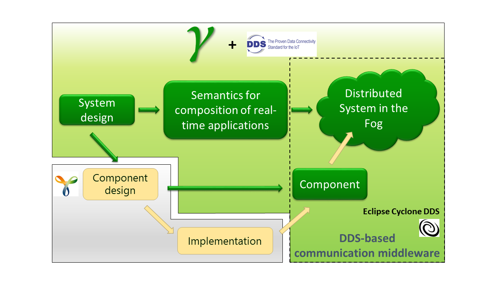
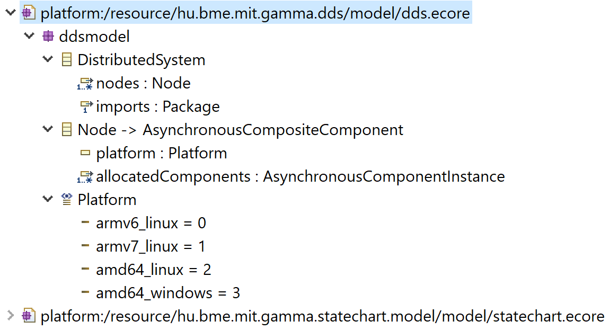
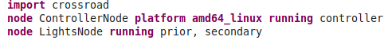
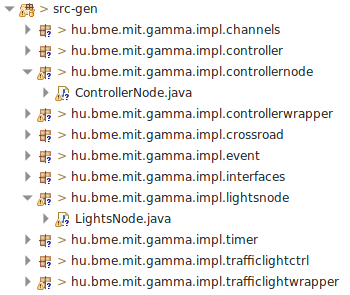



The Gamma Statechart Composition Framework is a toolset to model, verify and generate code for component-based reactive systems. The framework builds on Yakindu, an open source statechart modeling tool and provides an additional modeling layer to instantiate a communicating network of statecharts. Compositionality is hierarchical, which facilitates the creation of reusable component libraries. Individual statecharts, as well as composite statechart networks can be validated and verified by an automated translation to UPPAAL, a model checker for timed automata. Once a complete model is built, designers can use the code generation functionality of the framework, which can generate Java code for the whole system.
Our goal is to extend the capabilities of Gamma to:
- be able to run the components in a distributed real-time environment
- exploit the capabilities of the advanced DDS technology
- provide a design tool for the development of complex, distributed fog computing applications

# Code generation from state machines to DDS execution environment
After our first encounter with the Gamma Statechart Modeling Tools the idea of Gamma state machines communicating through DDS arose. As we were examining models, we thought it would be comfortable to run them on multiple computers. We could distribute the systems, and realize the communication over DDS. We could not find a tool for the development of distributed real-time applications, so our goal is to provide these capabilities. 

## The metamodel
We wanted to provide the user with an intuitive and easy-to-use definition language to describe the configuration of the distributed system: Xtext was made just for that. Our first step was to create the metamodel of the deployment. The root element of our models is a DistributedSystem, which contains Nodes. Each Node represents a computer of the system, and has a name, an optional platform attribute and a given number of AsnychronousComponentInstances (the components that are allocated, AsynchronousComponentInstances are defined in the Gamma Statechart metamodel). The user imports an arbitrary asynchronous Gamma composite model and allocates each of its components to a (execution) Node (a Node can have multiple components allocated to it, however every component must belong to exactly one Node).

## The DDSDsl Xtext language
Our language is rather straightforward to use. It is based on the metamodel we discussed above and comes with various usability features, such as code completion and live validation. The user defines the model to be deployed using the `import` keyword. Then, using the `node`, `running` and `platform` keywords the computing nodes can be specified. Allocation is defined using the defined nodes and functions.
Important part of the editor is that it completely hides the implementation specific details of the runtime environment.

## The code generator
After right-clicking a DDSDsl (.god) file in the Project/Package Explorer a context-menu appears with the “Gamma over DDS/Generate Java code” option. Selecting it, we can launch the code generator, which creates a package containing a Java class for each node. These classes closely resemble the classes Gamma generates for asynchronous composite components. Now the state machine can be used by instantiating the generated classes.

