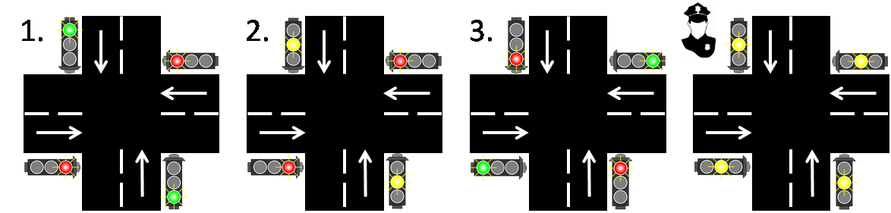
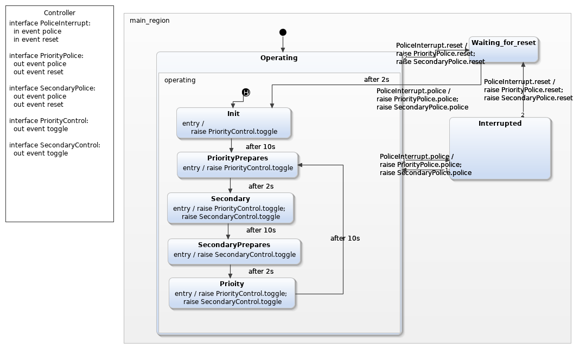
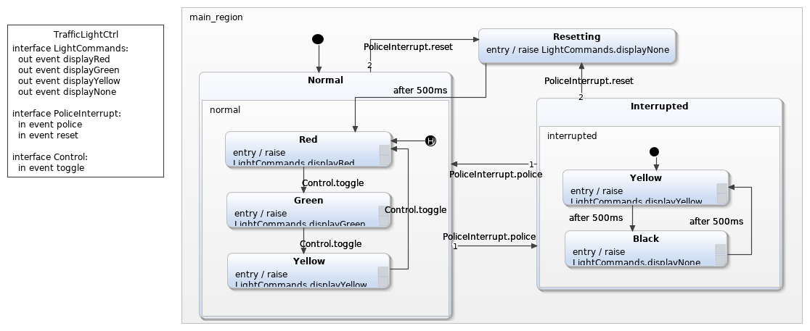
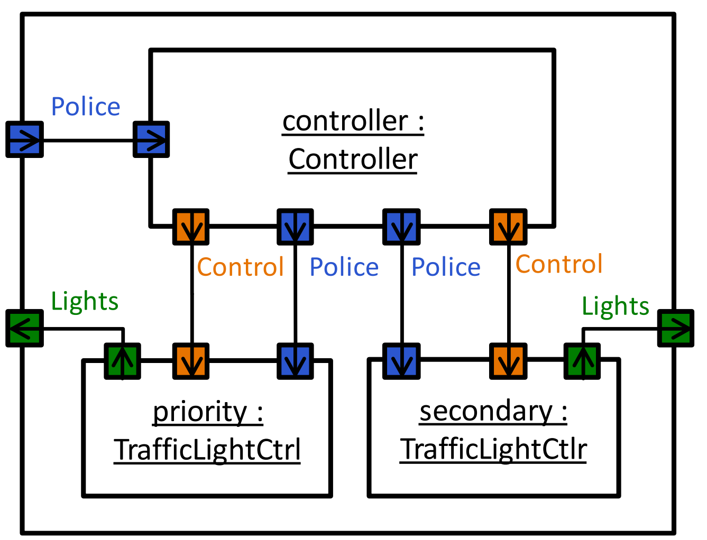

# Crossroad: a simple demo application

We chose to demonstrate the power of our tool with a crossroad consisting of 2 coordinated and controllable traffic lights. In each direction, the traffic lights are standard 3-phase lights looping through a red-green-yellow-red sequence. As an extra, there is an interrupted mode that may be triggered by the police – in this state, the yellow light is blinking.

## The models

First we created two simple Yakindu models, one for the controller and one for the lights.

### The controller

### The lights

## Realization of the distributed system

After creating the models we connected them using Gamma the following way:

Thereby we came to a properly working model - the next task was to divide it up into AsynchronousCompositeComponents, so that it can be run on multiple computers communicating through DDS. To do that, we situated them in so-called wrappers. Using our language we generated the necessary codes.

## Setting up the demo

The lamps are controlled by two Raspberry PI 2, the control can be arbitrarily managed from a computer or a physical button run by a third PI 2. To write controller programs, we used the PI4J Java library as it seemed to be convenient to use. As our Java programs belonging to the Nodes (in this case PIs) have already been generated, the controller programs were rather simple - they realize listeners, which start the appropriate program when the signal is detected. The only thing left was to commit the completed files on the PIs. We carried out the transmission with SCP, and finally - after lenghty debugging - the lights came alive.

## Video / photo of the demo

