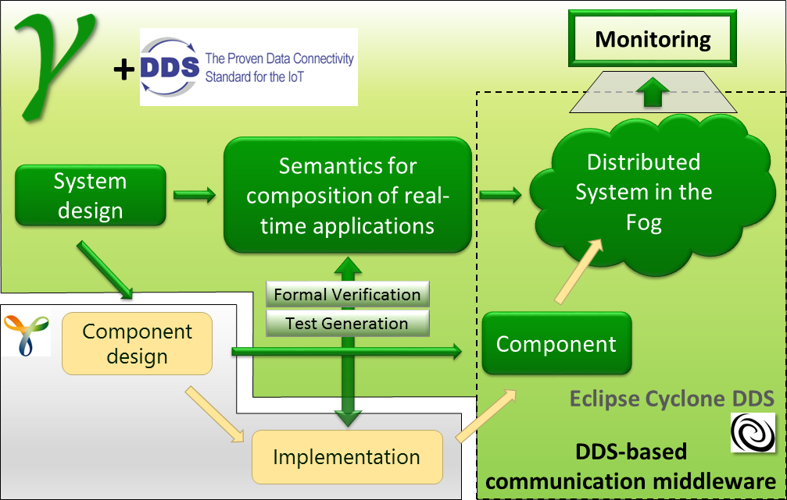


The Gamma Statechart Composition Framework is a toolset to model, verify and generate code for component-based reactive systems. The framework builds on Yakindu, an open source statechart modelling tool and provides an additional modelling layer to instantiate a communicating network of statecharts. Compositionality is hierarchical, which facilitates the creation of reusable component libraries. Individual statecharts, as well as composite statechart networks, can be validated and verified by an automated translation to UPPAAL, a model checker for timed automata. Once a complete model is built, designers can use the code generation functionality of the framework, which can generate Java code for the whole system.
In this project, we extend the Gamma framework to be able to synthesize distributed real-time applications, that can control IIoT applications in the fog. We chose the Gamma framework as we want to use its features such as verification, test generation and code generation. This way we can support the design of correct, distributed real-time applications.

The project goals can be summarized:
* generated code and synthesize the communication links between the components
* exploit the capabilities of the advanced DDS technology to provide fault-tolerant, real-time execution
* provide a design tool for the development of complex, distributed fog computing and IIoT applications

# Gamma-based system design
The Gamma framework provides a language, a verification and test generator tool and also code generators. This served as a basis for our work. You can find more information of the Gamma framework here: <http://gamma.inf.mit.bme.hu/>
Gamma proved its usefulness in various critical applications; this also motivated our work to further extend it to new dimensions.

# DDS runtime
DDS is a standard which is used by the industry for several years by now. It is especially suitable for critical, real-time applications as it provides various Quality-of-Service functionalities. Recently, the Eclipse Cyclone project was announced that opened new possibilities for our community to use DDS technologies in our open-source projects.
This motivated us to ask Prismtech to share the implementation of future Eclipse Cyclone DDS.
As far as we know, we are the first to evaluate it in such an open-source setting.

# Code generation 
We have extended the Gamma framework with our model transformations and code generators to enhance the capabilities of the framework. Our tool extends the Gamma framework with a deployment and allocation language. The code generator generates code for the DDS middleware which can be run in a distributed system. We had to take into account the specificities of the DDS protocol in the code generation and we had to bridge the semantic gap between DDS and high-level reactive design of systems.

# Deployment and monitoring
We have developed a deployment workflow to automatize the deployment of the components and avoid manual work. In the future, we plan to further fine-tune this workflow to be more efficient. In addition, at this level, an additional level of fault-tolerance can be built into the system.
A monitoring component receives operational information from the components and visualises it to the user. We also plan to visualise the quality of the network connections.
