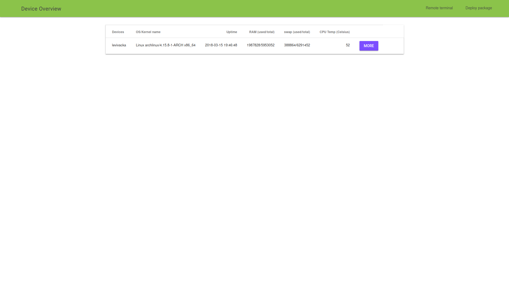
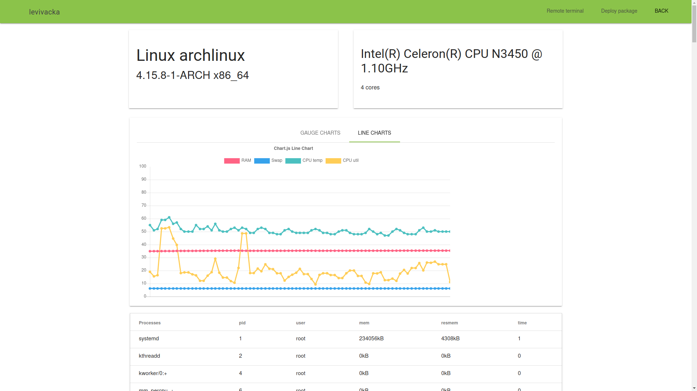

# Frontend
The aim of this part was to create a simple, real-time overview of the devices' status that are part of the current system.
The Dashboard includes two main pages:

* a list-like overview of all devices in the system with some of their significant health data 
* and a page dedicated to per device overview with
    * OS and Kernel information
    * CPU, RAM and Swap data (with visualization)
    * and a list of running processes.
* access to server and remote terminals and a specific pop-up to deploy packages

## Design
We used [Material Design Lite](https://getmdl.io/), as it relies only on html, CSS and vanilla javascript, works easily across most of the popular browsers and devices and is open-source (Apache License 2.0).

## Charts
Charts are only used per device to offer a cleaner end result.

The gauge charts (by [Chartist](https://gionkunz.github.io/chartist-js/)) give the user a graphical representation about the current status of the device, while the linechart (by [Chartjs](http://www.chartjs.org/)) provides a more detailed look on the changes of this status with time.
