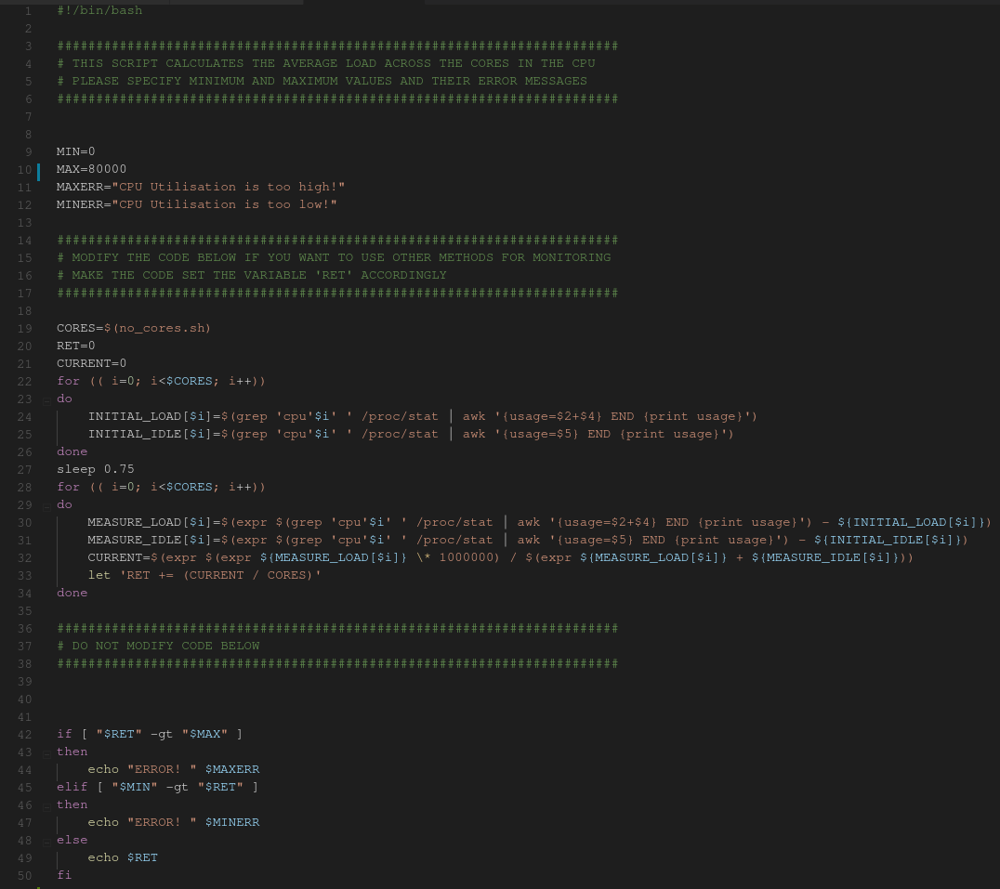

# Recording the data from the devices

The main feature of our beloved Dashboard is of course the monitoring system that records the data on the clients, publishes them through DDS, checks for errors, manages system modifiers and so on. In order to achieve all these we have devised a method that would not only work on this specific usecase and with these specific datatypes, but rather it would be as configurable as possible and therefore its usecase would cover way more than what we use it for.

# Overview

There are two types of devices:

    * Clients: collect the data, send it through DDS
    * Bridge: "translates" data got from DDS to the database, reacts to errors, registers pings from devices, etc.

With this kind of architecture we keep things as modular as we can: Bridges do not need to be bound to a specific device, they can be placed redundantly, be configured without much fuss and so on.

For the above mentioned actions there are 4 main partitions in our DDS domain: 

* Health: Pings and errors from the clients to the bridges
* Telemetry: collected data from the clients to the bridges
* Settings: Modifiers from the bridges to the clients

# More in detail

The devices send a "ping" message every X milliseconds (configurable amount) to the bridges that register these events and handle them accordingly - if a device fails to send a message for a given amount of time, the system assumes it is dead - an error message is displayed and a user-modifiable script gets executed (again, for the sake of modularity). This action could be virtually anything, from displaying the devices in red somewhere to sending an SMS via a connected GSM module (this last bit we haven't had the chance to experiment with, but would love to try soon).

# But where does the data come from?

Data is collected from bash scripts that are, again, modular - we have provided a way of data collection, but if, for some reason or another, the user decides not to employ them, it's fine - there is a variable in there that needs to be set, everything else gets handled accordingly.
