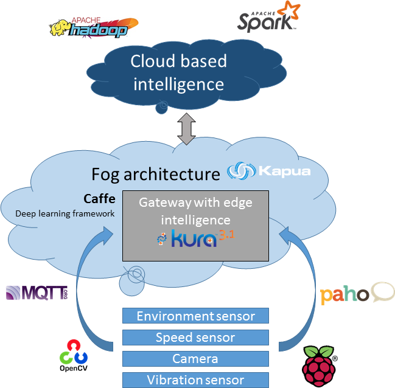

# Data collection and analysis system: IIoT solutions in the smart city

A smart city is not just about connecting devices, but we need a solution which is scalable, intelligent and able to handle the data explosion problem. Fog/edge computing is about solving the aforementioned issues, so we decided to build a complex fog computing architecture consisting of various IIoT technologies/solutions.

In the process of creating a modern sensor system which is capable of monitoring a railway system, we must solve various problems. The first and the most evident problem that we face when modelling a large-scale system is the sheer amount of gathered data. For example, let’s have a system with 1000 trains, each with ten sensors on them. Let’s say we place relatively few sensors on the rails (10 monitoring sensors every kilometre, usually at semaphores or train stations), and the length of the tracks is 1000 kilometres. If each sensor generates about 10kBytes of data per second (in average), that would mean almost 20000 sensors are sending 400 MBytes of data every second. If we intend to use this data for future analysis, we have to store approximately 12 PBytes of data annually. 

As a result, traditional methods of data processing are insufficient to overcome the difficulties. Thus, we must develop a modern, distributed system with a hierarchy of the assets. 

To keep our system efficient, we must filter the gathered data only to keep the relevant information. During this process, we can also detect many dangers and anomalies.
For this reason, we created a multi-level data processing system. It is a strongly hierarchical system with local hubs that can collect, filter and forward the data from the sensors to a central data analyser software. These local collectors are Eclipse Kura based gateways that can efficiently detect and handle local problems with the use of edge computing. The hubs are connected to a device management software that collects data, and also provides an interface for the configuration of the gateways. Our data manager software then reads the data from the local database of the device manage and send the data into our bigdata analysis server, which calculate the mechanical stress of the physical system, approximate the time of the next maintenance, search for malfunctioning devices and creates reports about the conditions of the operation.
