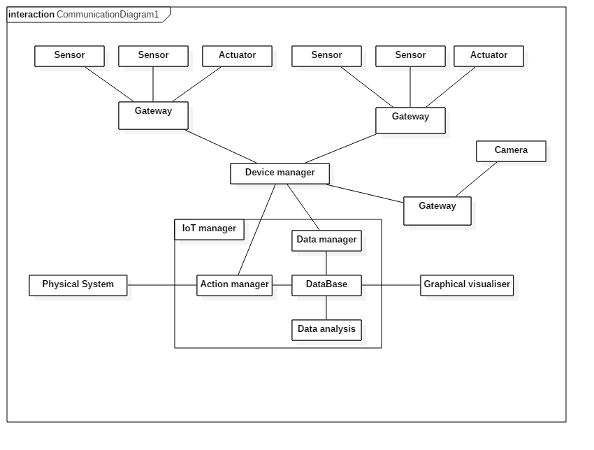

## About the architecture of the IoT system

If we want to create a modern sensor system which is able to monitor a railway system, we have to solve vast amount of problems. Firstly, the capacity of the data is enormous. If we assume there are a thousand train in the system with 10 sensor per train and we have 1000 km rail and we have only ten rail monitoring sensor per kilometer (for example near the semaphores or near the train stations) and each sensor generates in average 10 kiloByte of data in each second.  That means there are twenty thousand sensors and we have four hundred megabyte new data in each second. 
If we want to consistently keep the data for analysis, we have to handle 12 petaByte in each year.
As a result, the traditional methods of data processing are not good enough, we have to create a modern, distributed system with a hierarchy of the assets and we need to filter the data in order to keep only the relevant informations and detect any kind of danger or anomaly.

Thus we created a multi-level data processing system. It is a strongly hierarchical system with local centers which are able to collect, filter and forward the data of the sensors to a central data analyser software. These local collectors are Eclipse Kura based gateways with edge computing ability in order to detect and handle local problems. These gateways are connected to a device manager software which collects all data from the gateways and also provide an interface for the configuration of the gateways. Then our data manager software reads out the data from the local database of the device manager.

