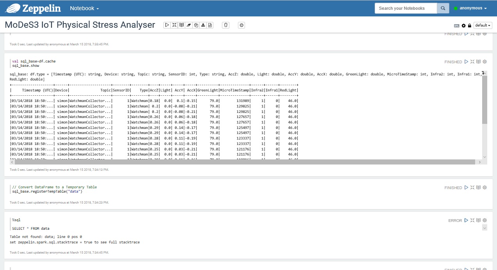

Smart systems need intelligent techniques. Intelligence is based on the data and also the techniques used to process the data and produce information and value. In the former posts, the basic approach was introduced and the open-source techniques at the sensor side were detailed. However, we also integrated a complex data analysis backend to gain useful insights during the operation and implement intelligence for the overall system.

## How to process sensor data?

As you could read in our previous blog posts, we created a complex distributed sensor system, which can even generate hundreds of megabyte of data in each second (in real-life systems :) ). Although we use a number of streaming and filtering methods in order to keep only the relevant information, we might have to handle, store and process an incredibly huge amount of data. As a result we have dropped the traditional methods and changed to the newest data warehouse solutions. For our application we have chosen the Hortonworks Data Platform, which provides a great set of tools of data management and analysis. Thus our system based on the Hadoop Distributed File System, consequently we have the possibility to keep the collected data for years, and do long-term data analysis to predict amortisation and observe the effect of weather on the infrastructure. We have chosen the Spark framework, since it gives us a dozen of scalable data processing tools and it also supports all modern high level programming languages like Java Scala or R. For our demonstration we used the Dataframe API in Scala with Zeppelin thus we could visualise the results of the analysis immediately.

The innovative combination of open-source Eclipse based solutions (such as Kura, Kapua) and the open-source data analysis platforms yields an end-to-end solution for managing data in distributed IoT systems.

