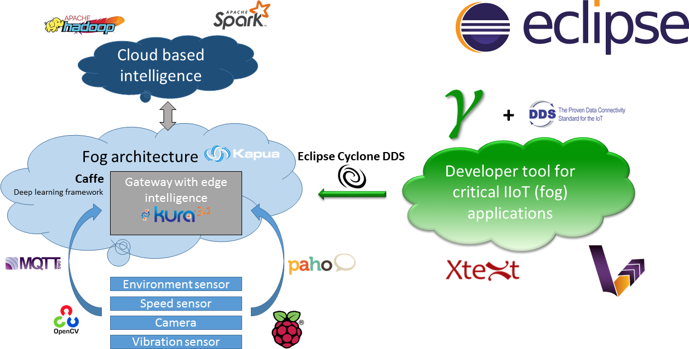

# MoDeS3-SmartCity
## A project for the Open IoT Challenge 4.0

Hi All!  We are a group of students and researchers from the Budapest University of Technology and Economics. You will see our innovative project of building a smart city, on top of a demonstrator railway system. The ingredients of our project are various open-source technologies (Eclipse, Apache) and we heavily relied on the well-established foundation of the fog computing paradigm.

Our three main achievements will be detailed in the following:

1. We introduce a smart transportation system, with the innovative use of IoT technologies.
2. We introduce a developer tool supporting the design and implementation of distributed fog applications.
3. We developed an end-to-end solution for data collection and analysis based on open-source techniques

MoDeS3 – Smart City project integrates these innovative solutions into a common framework and testbed.

### Smart transportation system
Railway transportation is an important participant in the global economy and also the main motivation in our setting: we developed a control and monitoring system to collect data of the trains and their freight. Computer vision and (open-source) neural network based detection algorithms provide the automatic recognition of the trains, and the gathered information is used to detect delays and schedule problems. In addition, various sensors are used to provide data to optimize the traffic, avoid accidents and detect anomalies. Temperature sensors monitor the conditions of the rails, speed sensors detect dangerous situations, and the collected data provide insights into the overall working of the transportation system.

### Developer tool supporting the design and implementation of distributed fog applications
Rigorous techniques and tool support are needed to handle the complexity of distributed fog computing applications. As a transportation system is a typical example of a fog computing problem, MoDeS3 served as a perfect motivation to develop a design tool for the correct construction of complex distributed systems. Fog computing is the future of the Industrial Internet of Things, which further motivates our developments. Our developments aim the extension of the Gamma tool (developed at the Budapest University of Technology and Economics) with a DDS-based communication middleware to provide real-time and reliable communication. We have evaluated the DDS implementation, which will be part of the Eclipse ecosystem in the frame of the Eclipse Cyclone project. The implementation was provided by Adlink (<http://www.prismtech.com/dds-community/dds-community-v67-overview>). Our tool is fully based on Eclipse technologies provided by the Eclipse Modeling Framework. The open-source Yakindu framework provides graphical editor, the code generators are based on the open-source VIATRA framework and various language extensions are designed by using XText. 

### End-to-end solution for data production and analysis based on open-source techniques
We have developed an end-to-end solution for the aforementioned problems based on open-source and mainly Eclipse-based technologies. Eclipse Kura runs on the gateways (Raspberry Pi and BeagleBone Black microcomputers) and processes sensor data. Data is then aggregated with the help of the Eclipse Kapua framework, which also manages the gateways and the nodes. Many integration problems were revealed and solved during the development. Data analysis uses the open-source Apache Spark and Hadoop technologies. The full management and data processing framework is integrated and ready to ingest the huge amount of IoT data.

## Read the posts! 
In the following posts, we will detail each component and share the experiences we gained during the developments. The project is huge: it consists of the integration of more than 15 open-source technologies, many of them part of the Eclipse ecosystem, and we also evaluated the technology behind the Eclipse Cyclone project (which is not yet available).

Our results are the following:

- Integration of Eclipse and Apache open-source technologies into a consistent framework
- Development of an innovative DDS-based fog-computing design tool, tailored to the requirements of complex IIoT applications
- Novel open-source testbed for IIoT systems in the form of a railway transportation system
- Evaluation of many open-source technologies in the “wild”

Stay tuned; more blog posts are coming!

<iframe width="560" height="315" src="https://www.youtube.com/embed/_L8sIPL8tPk" frameborder="0" allow="autoplay; encrypted-media" allowfullscreen></iframe>

