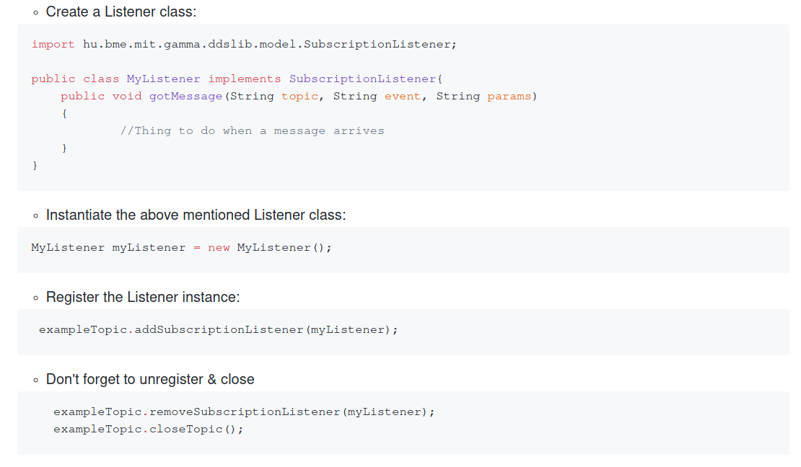
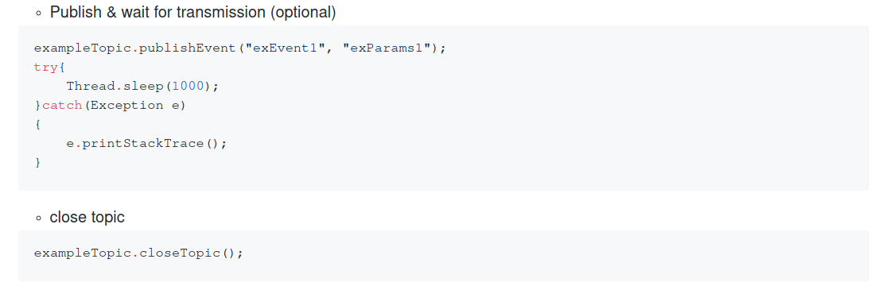

## Java library for interfacing with the OpenSplice DDS implementation

### Requirements

* OpenSplice
* JDK (fairly new, but anything newer than java 5 should work).
* A gnu/linux distribution. Tested on:
    * Arch Linux (kernel version 4.15.3) with OpenSplice Community Edition (linux x64)
    * Ubuntu 17.10 with OpenSplice Evalutation Version (linux x64)
    * Debian Stretch with OpenSplice Evaluation Version (armv7, BeagleBone Black)
    
Other distro-OpenSplice combinations might work too, but they haven't been tested for compaitibility.

Always run `. $OSPL_HOME/release.com` before compiling or running the application in the terminal you're using on all platforms. (You might need to export $OSPL_HOME yourself before being able to do that).

### Building

1. Build only - `make` or `make compile`
2. Example application - `make run`
This will compile and start the example application.
3. Library - `make package`
This will compile the library and place it into the `lib/` folder.
A pre-built version is already in there, but you might want to consider rebuilding it if you encounter any problems.

### Using the library

For a simple implementation look at the project in the `standalone_project` folder. It is a CLI messaging application that uses this library (and hence the OpenSplice DDS implementation) to communicate.


* For both Compiling and Running

    * Run `release.com` from inside your OpenSplice installation folder
    
``` bash
    . ./path/to/release.com
```
    
   * Add to classpath: `$OSPL_HOME/jar/dcpssaj5.jar`, `lib/hu.bme.mit.gamma.ddslib.jar`

* Both Subscription and Publishing
* Import `hu.bme.mit.gamma.ddslib.model.*`, `hu.bme.mit.gamma.ddslib.opensplice.*`, `hu.bme.mit.gamma.ddslib.threads.*`

    * Initialize the Service Environment:
    `DDSLib.init();`
    
    * Create a Topic<sup>1</sup>: `Topics exampleTopic = new Topics("exPart", "exTopic");`
    
* Only Subscription

    
* Only publishing

Important: you need to create a `Topics` instance for both the receiving and the transmitting parties! 

### Example
The example sources are in `src/hu/bme/mit/gamma/ddslib`, and consist of `Example.java`, the main source file and `MyListener.java`, an implementation of the `SubscriptionListener`.

***
<sup>1</sup>: for other options, open `src/hu/bme/mit/gamma/ddslib/opensplice/Topics.java`, and look at its constructors.